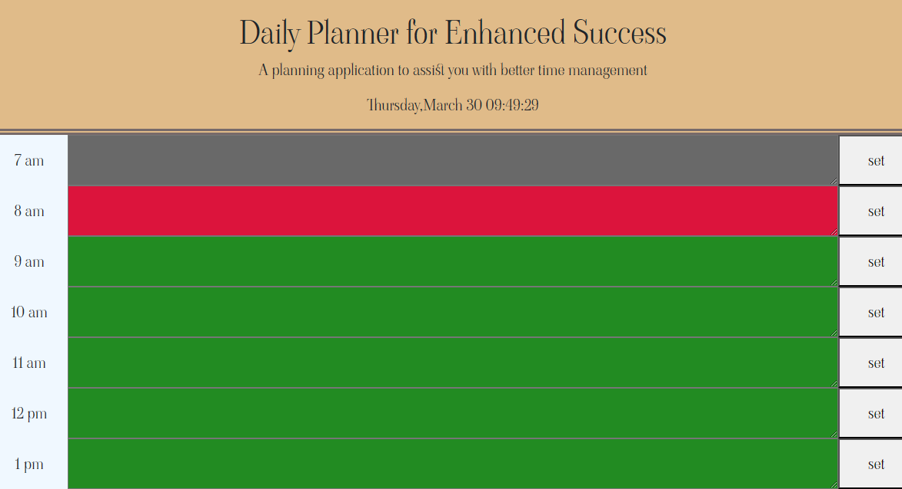

# Work-Day-Scheduler

## Description

This is the initial version of AD's work day scheduler submitted by "AD" for Penn Full Stack Web Development. The scheduler is meant to assist the user in recording thier daily schedule at given time increments that will change color throught the day given if the action item is in the past present or future. This project was particular due to its use of Bootstrap. I have spent the last couple of days looking over bootstrap to determine, specifically for this project, was best grid options to use and how i can implement them in the future. 
## Installation

N/A

## Usage

To navigate the scheduler, scroll to the appropriate time and select the input area to begin typing text. once the user has typed their text, click save, reload the page and see the same saved items are stil in place. This can be used to improve user time management and organize the day.

.png

[Program](https://0adean0.github.io/Work-Day-Scheduler/)

## Credits
Bootstrap information
W3 schools articles
## License

MIT License